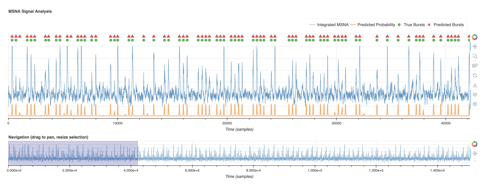

# MSNA Burst Detection

[](https://opensource.org/licenses/MIT)
[](https://badge.fury.io/py/msna-detect)

A deep learning framework for automated detection of bursts in Muscle Sympathetic Nerve Activity (MSNA) signals.


## Overview

Muscle Sympathetic Nerve Activity (MSNA) provides direct measurement of sympathetic outflow to skeletal muscle vasculature, offering insight into neural mechanisms governing cardiovascular control. This repository presents a robust and efficient deep learning framework for automated detection of bursts in MSNA signals, addressing a challenging task that traditionally requires time-consuming manual annotation by experts. Our approach utilizes a 1D convolutional neural network based on U-Net architecture that reformulates burst detection by modeling probabilistic distributions around burst points. The framework exploits CNN translation invariance with random window sampling for efficient training, and can process recordings of arbitrary length without boundary artifacts during inference. 

This library provides a simple API for both training and inference, along with pre-trained models for immediate application.


## Installation

You can install the package from PyPI:

```bash
pip install msna-detect
```

Or you can install from source:

```bash
# Clone the repository
git clone https://github.com/ryanirl/msna-detect.git
cd msna-detect

# Install dependencies
pip install -r requirements.txt

# Install the package
pip install -e .
```

See `requirements.txt` for the full list of dependencies.


## Quick Start

### Inference with Pre-trained Model

```python
from msna_detect import MsnaModel

# Load your MSNA signal (should be shape [channels, time] or [time])
signal = ...

# Load the pre-trained model
model = MsnaModel.from_pretrained("pretrained/model.pth")

# Get burst probabilities
burst_probs = model.predict_proba(signal)

# Find burst peaks
burst_locations = model.find_peaks(signal, height = 0.4, distance = 100)

print(f"Found {len(burst_locations)} bursts")
```

### Training a New Model

```python
from msna_detect import MsnaModel

# Prepare your training data
signals = [signal1, signal2, ...]  # List of numpy arrays, each of shape [channels, time]

bursts = [burst1, burst2, ...]     # List of numpy arrays with binary burst annotations

# Create and train a model
model = MsnaModel(sampling_rate = 250, device = "cuda")
model.fit(
    train_signal = signals,
    train_bursts = bursts,
    epochs = 50,
    lr = 0.01,
    batch_size = 32
)

# Save the trained model
model.save("my_trained_model.pth")
```

For more advanced usage examples, see the `examples/` directory.


## Dataset Format

The model expects MSNA data as NumPy arrays. For training, both signals and burst annotations should be provided:

```python
# Example format for training data
signals = [signal1, signal2, ...]  # List of numpy arrays, each of shape (time,)
bursts = [burst1, burst2, ...]     # List of numpy arrays with binary burst annotations
```


### Visualization Dashboard


<p align="center">
 
</p>


The package includes an interactive visualization dashboard built with Bokeh
that allows you to explore MSNA signals and their detected bursts. The dashboard
provides:

- Interactive visualization of the integrated MSNA signal
- Overlay of true and predicted burst locations
- Probability distribution of burst predictions
- Navigation tools for exploring long recordings
- Hover tools for detailed signal inspection

To use the dashboard you can run the dashboard on a CSV file containing MSNA data

```bash
python dashboard.py --input path/to/your/data.csv
```

You can also export the dashboard as an HTML file

```bash
python dashboard.py --input path/to/your/data.csv --save
```

The input CSV file should contain the following columns:
- `Integrated MSNA`: The normalized MSNA signal
- `Burst`: Binary annotations of true bursts
- `Predicted Burst`: Binary annotations of predicted bursts
- `Predicted Probability`: Probability scores for burst predictions


## Architecture

Our approach utilizes a 1D convolutional neural network based on the U-Net architecture:

1. **Input**: MSNA integrated signal. Normalization is done by the model.
2. **Processing**: Four downsampling stages with ResNet-like encoder blocks
followed by corresponding upsampling stages with skip connections.
3. **Output**: Probability map where peaks correspond to detected bursts. Peak
finding is done on this probability map to get out predicted bursts.

The model is trained by:
1. Transforming sparse binary annotations into soft distributions using Gaussian convolution
2. Random window sampling for computational efficiency
3. Optimizing with mean squared error loss
4. Post-processing with calibration to ensure consistent probability scaling


## License

This project is licensed under the MIT License. See the `LICENSE` file for details.


## Citation

If you use this code in your research, please cite our paper:

```bibtex
@article{msna2025,
  title={Muscle Sympathetic Nerve Activity Burst Detection},
  author={Peters, Ryan},
  year={2025}
}
```


